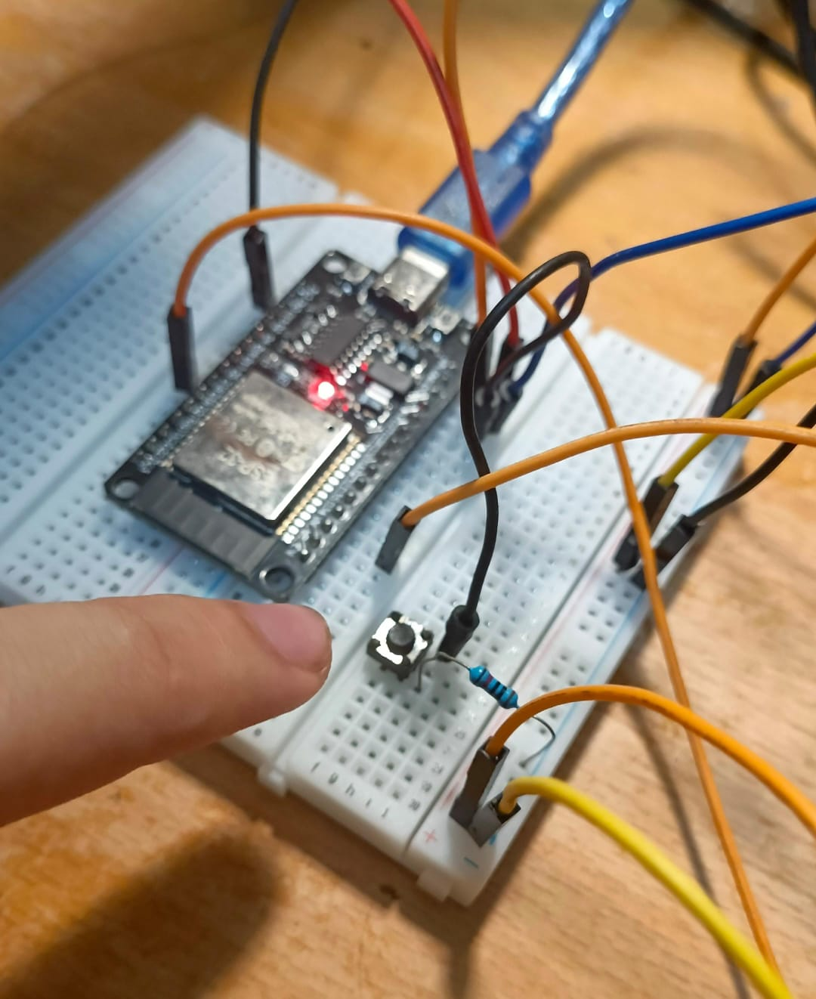
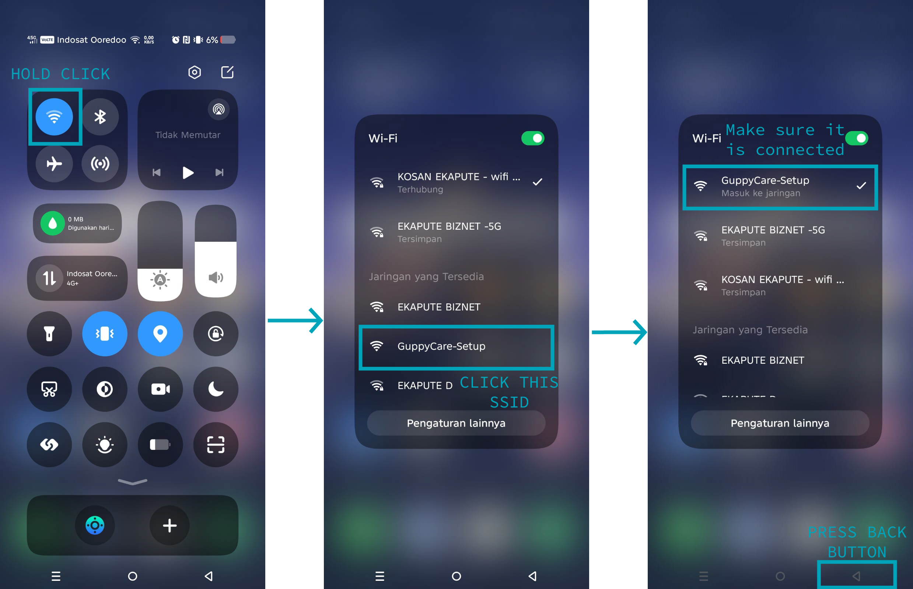
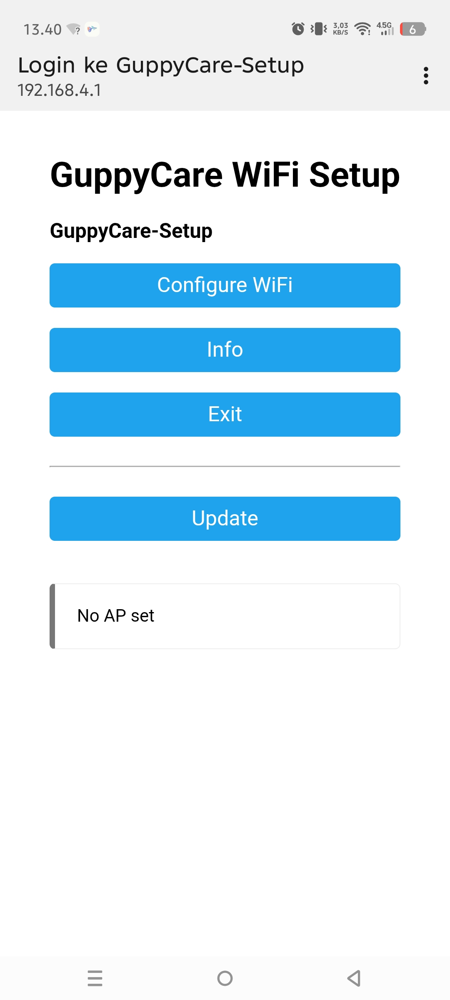
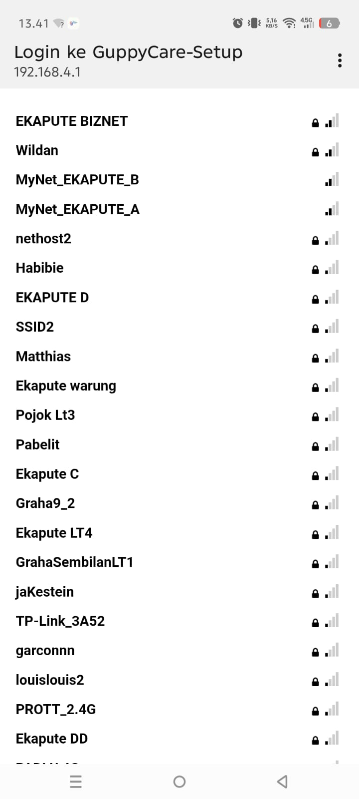
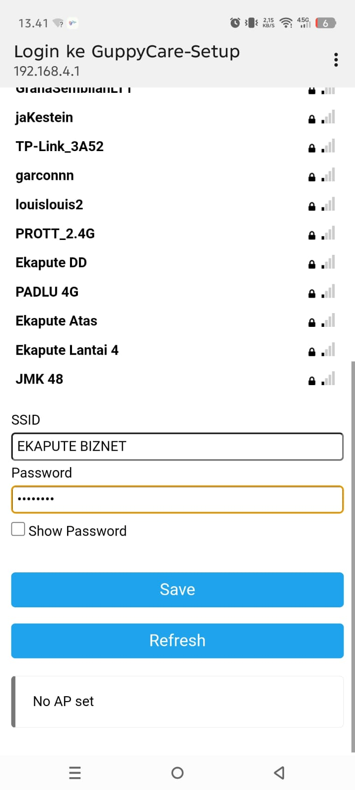
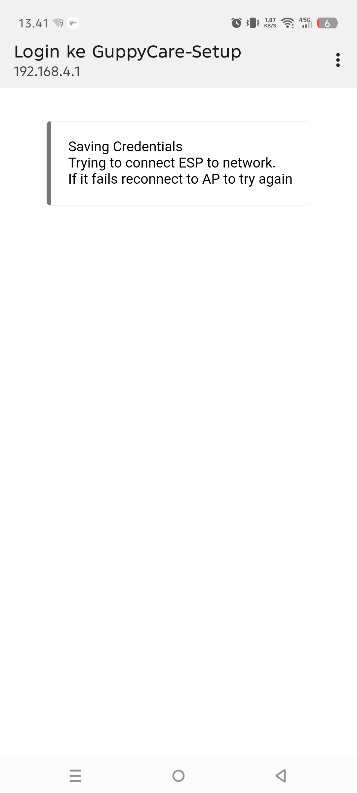
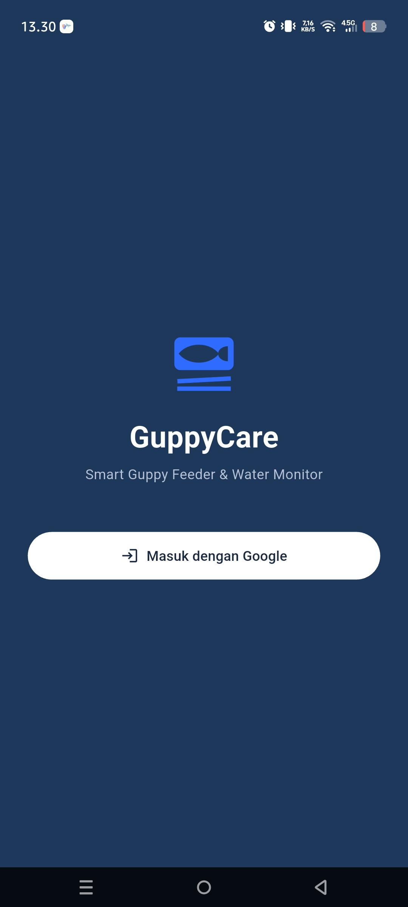
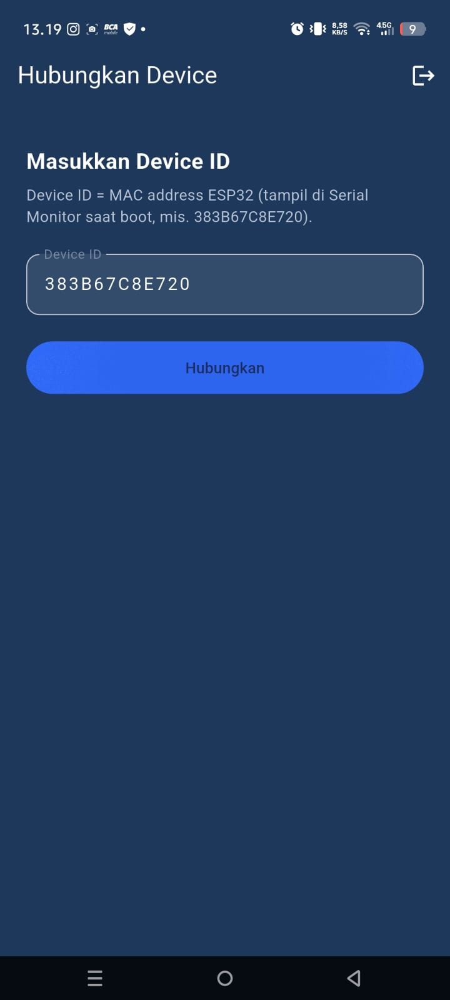
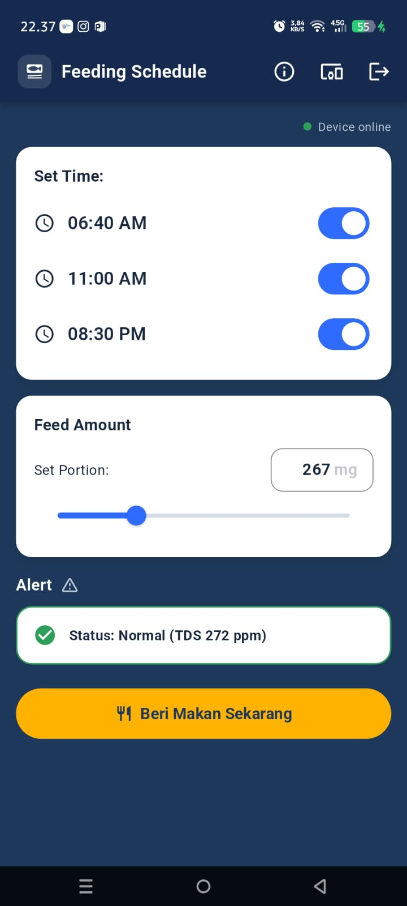

# GuppyCare

An automatic system for guppy aquariums, built with an ESP32 device and an Android app.

What it does:

- Feeding schedule: three feeding times you can turn on or off from your phone.
- Feed amount: set the portion from 1 to 1000 mg with a slider or by typing a number. An SG90 servo opens the feed gate for the matching amount.
- Water monitoring: when the water gets dirty (TDS above 600 ppm), the app sends a notification to your phone.

The app is free. You install it by downloading the APK below, not from the Play Store.

This guide is written for the person who actually uses the device. Follow it in order: first set up the device, then download and install the app, then open the app for the first time.

## What you need

- The assembled GuppyCare device (ESP32 with the servo feeder and TDS probe already wired).
- A 5V power supply (USB power adapter or power bank) with the right cable for the device.
- An Android phone.
- Your home WiFi name and password.

## Step 1: Set up the device

1. Plug the 5V power supply into the device. The device turns on as soon as it has power.

2. Press and hold the WiFi setup button on the device for about 3 seconds, then let go. This puts the device into setup mode. The very first time you power it on, it already starts in setup mode on its own, so you can skip the button.

<p align="center"></p>

*The WiFi setup button on the breadboard. Hold it for about 3 seconds to put the device into setup mode.*

3. On your phone, open Settings, then WiFi. Look for a network named **GuppyCare-Setup** and tap it to connect. There is no password. Make sure the phone shows it as connected, then press the back button.

<p align="center"></p>

*Open the WiFi list, tap the GuppyCare-Setup network, and make sure the phone is connected before you go back.*

4. A setup page usually opens by itself after a few seconds. If nothing opens, open your phone browser and go to **192.168.4.1**. On the GuppyCare WiFi Setup page, tap **Configure WiFi**.

<p align="center"></p>

*The setup page at 192.168.4.1. Tap Configure WiFi to start.*

5. The device shows a list of nearby WiFi networks. Tap your home network. Pick your **2.4 GHz** network, not the 5 GHz one, because the device only works on 2.4 GHz.

<p align="center"></p>

*Choose your home WiFi from the list. Use the 2.4 GHz network, not 5 GHz.*

6. Type your home WiFi password, then tap **Save**.

<p align="center"></p>

*Enter your WiFi password and tap Save.*

7. The device saves the settings and restarts to connect to your home WiFi. The GuppyCare-Setup network disappears once it is connected, and your phone goes back to your normal WiFi.

<p align="center"></p>

*The device saves the credentials and connects to your home WiFi.*

If you ever change your WiFi or move the device to a new place, just repeat this step: hold the WiFi setup button for 3 seconds and connect to GuppyCare-Setup again.

## Step 2: Download and install the app

The app file is on the Releases page of this repository:

https://github.com/slisanz/GuppyCare_apk/releases/latest

### If you are on the phone you will use the app

1. Open the link above in your phone browser.
2. Scroll down a little until you see the **Assets** section.
3. Under Assets, tap the file that ends with **.apk** (named GuppyCare with the latest version number). The download starts.
4. When the download finishes, tap the downloaded file (from the notification bar or your Downloads folder).
5. Android may say installing from this source is not allowed. Tap **Settings**, turn on **Allow from this source**, then go back.
6. Tap **Install**, wait a moment, then tap **Open**.

### If you are on a PC

1. Open the link above in your computer browser.
2. Scroll down to the **Assets** section under the release.
3. Click the file that ends with **.apk** to download it to your computer.
4. Move that APK file to your phone (USB cable, Google Drive, WhatsApp to yourself, or any way you normally transfer files).
5. On the phone, open the APK file and follow steps 5 and 6 from the phone section above to install it.

## Step 3: First time you open the app

1. Open the GuppyCare app.
2. Sign in with your Google account.
3. Enter the device id and connect to your device. After that the home screen shows the feeding schedule, feed amount, and water status, and you can control everything from your phone.

<p align="center">
  
  
  
</p>

## Notes

- Keep the device powered and on your home WiFi so the app stays in sync. If you unplug it, the app shows the device as offline until you power it back on.
- One device can be used by more than one phone. Each person signs in with their own Google account and connects to the same device id.

## For developers

This section is only for building from source. A normal user does not need any of this, just download the APK above.

Firmware (ESP32, PlatformIO with the Arduino framework):

1. Install PlatformIO.
2. Copy `src/fcm_credentials.h.example` to `src/fcm_credentials.h` and fill in your Firebase service account credentials. This file is not committed.
3. Build and upload to the board (set the correct COM port, baud 921600).
4. Open Serial Monitor at 115200 to see the log and the device id.

App (Flutter, Android):

```
cd mobile_app
flutter pub get
flutter build apk --release
```

The built APK is in `mobile_app/build/app/outputs/flutter-apk/`.

The app uses Firebase Authentication, Realtime Database, and Cloud Messaging. The files `google-services.json` and `firebase_options.dart` hold the project configuration (client API keys, not secret, the same values that ship inside the APK). Make sure the Realtime Database security rules are locked down before wider use. Do not leave them in open test mode.
